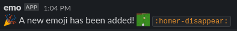

# Slack Emoji Notify

This is a simple, silly project. My friends group uses Slack to communicate primarily, and it is difficult on the Slack mobile app to see new emojis and the shortcut to use them.

This bot simply listens for the [`emoji_changed` event](https://api.slack.com/events/emoji_changed) and sends a message to the specified channel with the emoji and the shortcut:



## Tech Stuff

This bot makes use of Slack's [Bolt framework](https://slack.dev/bolt-js/concepts), which makes it incredibly easy to get working.

There are three `.env` variables needed:

```python
# .env
SLACK_SIGNING_SECRET=<signing_secret>
SLACK_TOKEN=<token>
CHANNEL_ID=<channel_id>
```
